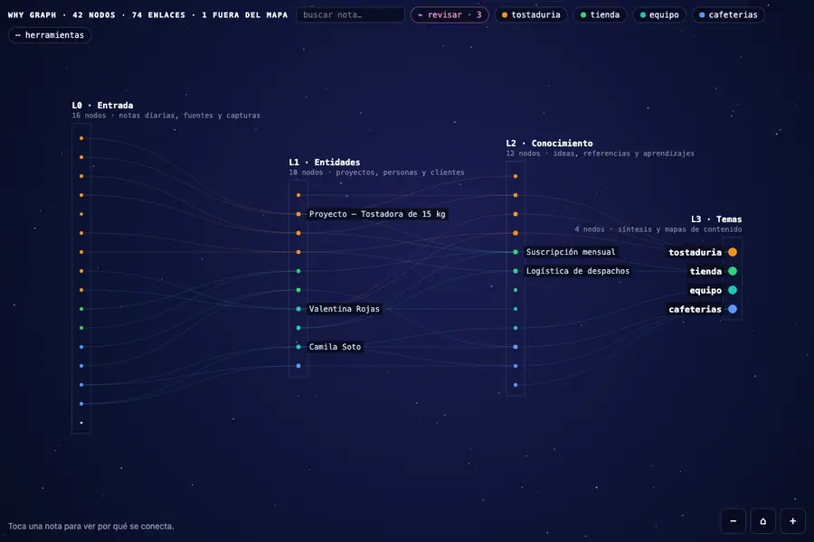
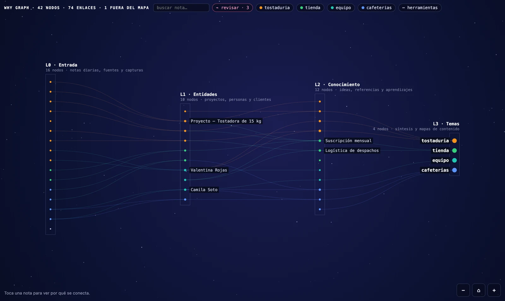
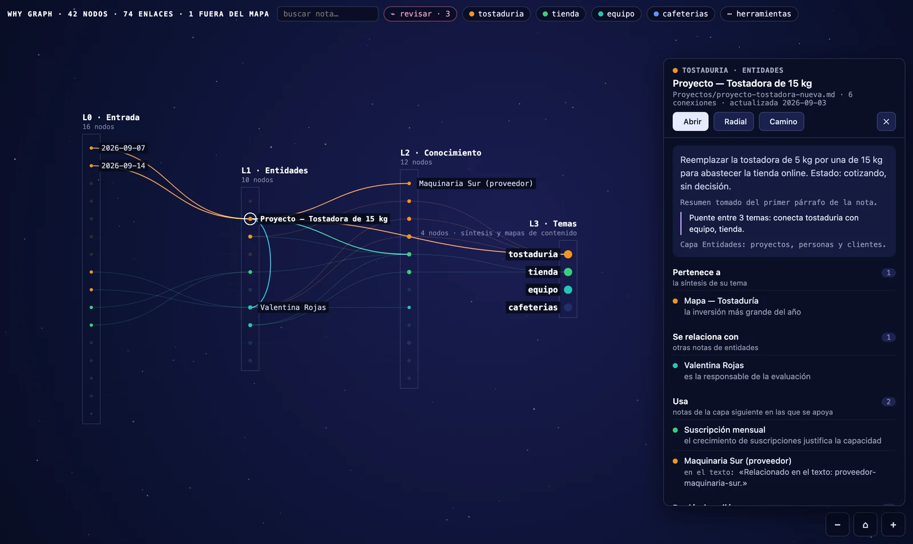
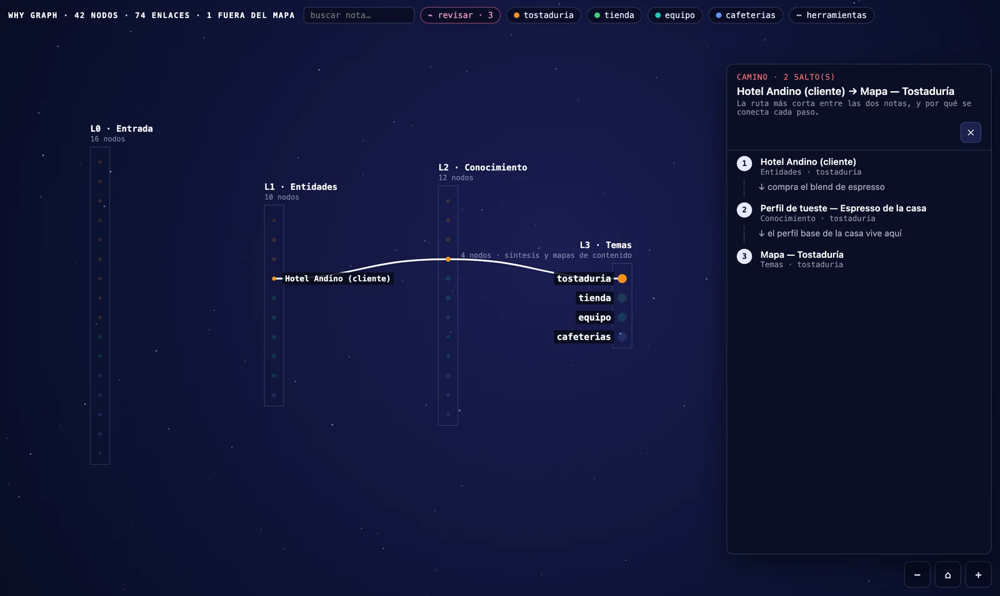
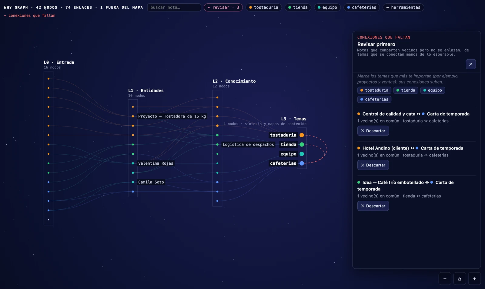
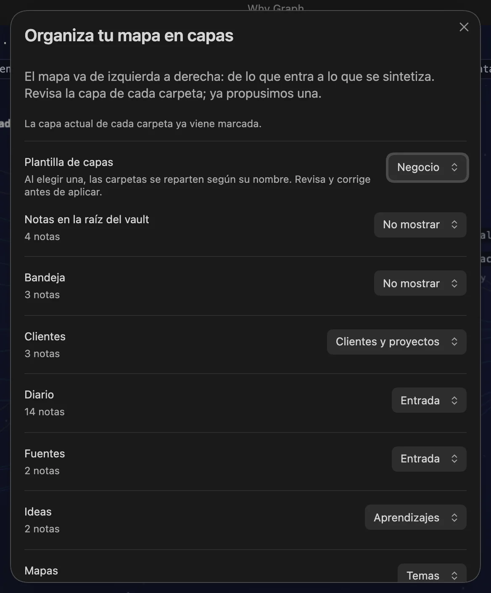
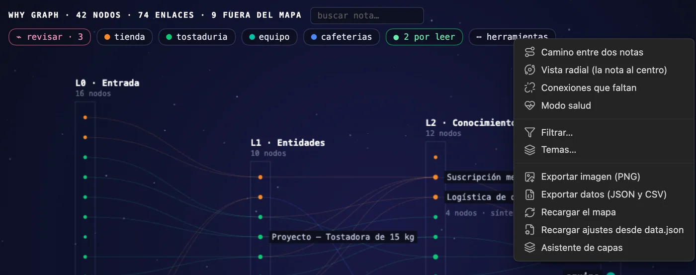
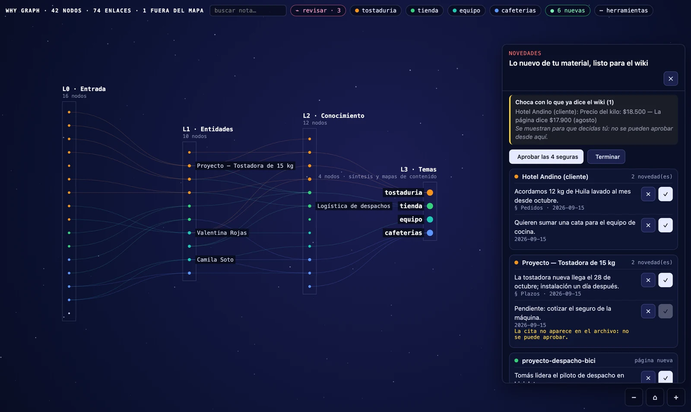
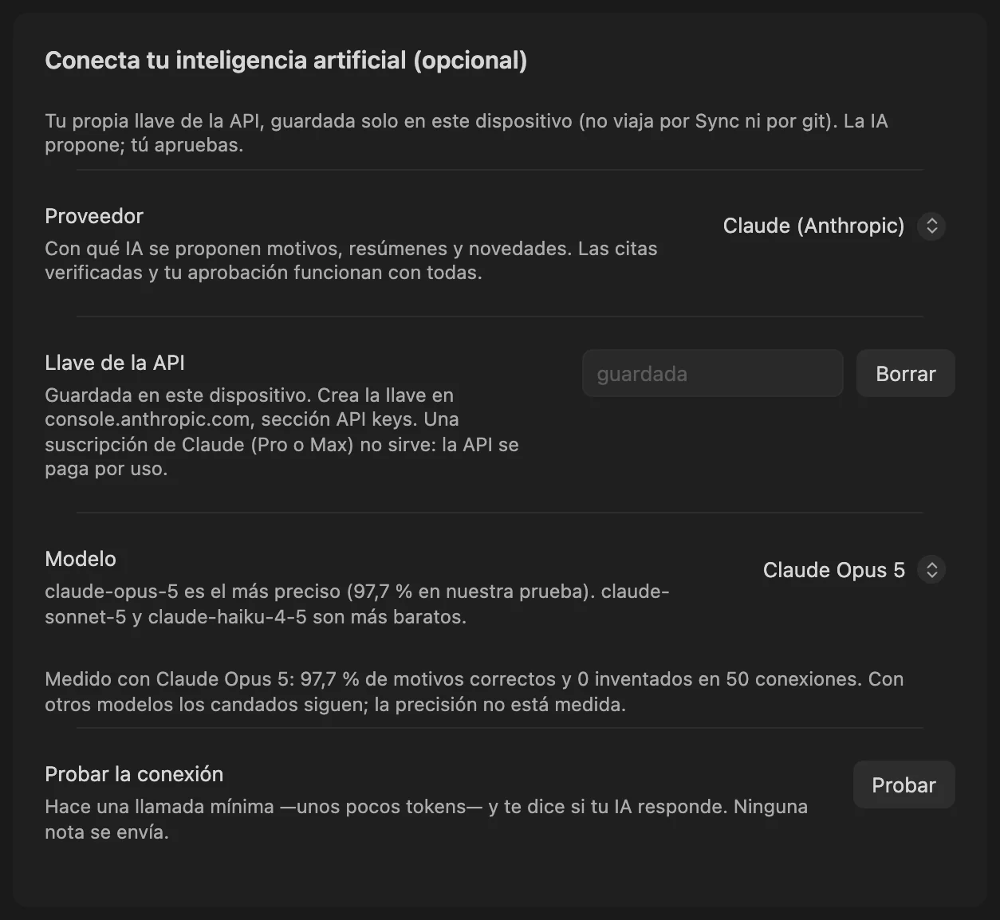

<div align="center">


# Why Graph

**Obsidian's graph shows you *that* two notes are linked. This one shows you *why*.**

Made for [LLM wikis](https://gist.github.com/karpathy/442a6bf555914893e9891c11519de94f) · works with any vault that has structure

[](https://github.com/DBB-FC/why-graph/releases/latest)
[](https://github.com/DBB-FC/why-graph/actions)
[](https://obsidian.md)
[](#install)
[](LICENSE)
[](#everything-else)

*English · [Leer en español](README.es.md)*



<sub>Five real views, no mock-ups: the layered map · a note with every reason · the missing connections · a path between two notes · the radial view</sub>

<a href="https://www.buymeacoffee.com/DbbLabs" target="_blank"></a>

</div>

---

In a vault of a few hundred notes, the standard graph is a hairball: pretty, and useless for
thinking. Why Graph lays your notes out in layers, left to right, the way information actually
moves through a knowledge base — **what comes in → what it is about → what you learned → what it
all adds up to** — and on every link it puts the sentence in which that link was written.

Not a guess. The real line from your own note.

|   |   |
|---|---|
| **[What it does](#what-it-does)** · the four things you get | **[Install](#install)** · two minutes |
| **[First run](#first-run-in-one-minute)** · the wizard reads your folders | **[Bring your own AI](#bring-your-own-ai-optional)** · optional, and free if local |
| **[What it expects from your vault](#what-it-expects-from-your-vault)** · read this before installing | **[Everything else](#everything-else)** · settings, cost, privacy, accuracy |

## What it does

<table>
<tr>
<td width="50%"></td>
<td width="50%"></td>
</tr>
<tr>
<td><b>Layers, not a hairball.</b> You decide which folders belong to which layer. Notes inside a layer are ordered to minimise crossing lines, so the paths you see are the paths that exist.</td>
<td><b>Every link carries its reason.</b> Either the reason you curated (<code>- [[note]] — why</code>) or the real sentence from the note where the link appears. Nothing is invented.</td>
</tr>
<tr>
<td></td>
<td></td>
</tr>
<tr>
<td><b>Paths.</b> Pick two notes and read the shortest chain between them, hop by hop, with the reason for each. This is how you find out that two projects you thought were related are four hops apart.</td>
<td><b>Missing connections.</b> A short <i>review first</i> list: notes that share neighbours but are not linked, from topics that connect less than expected. Star the topics you care about — say, projects and sales — and theirs come first. In my own vault it found two topics with <b>0 links where ~26 were expected</b>.</td>
</tr>
</table>

And also: a **radial view** that centres on one note and shows its world in rings · **English and
Spanish**, following Obsidian's own setting · **the phone**, same map and touch gestures, no
separate build · **export** to PNG, to an Obsidian Canvas you can keep editing, or to a
standalone HTML page.

## Install

**From the community directory** — Community plugins → Browse → search **Why Graph** → Install → Enable.

<details>
<summary>Other two ways: BRAT, or by hand</summary>

### With BRAT — installs and keeps updating itself

1. Install **Obsidian42 - BRAT** from the community plugins.
2. Command palette → **BRAT: Add a beta plugin for testing**.
3. Paste `DBB-FC/why-graph`.

BRAT installs it, enables it, and updates it on every release.

### By hand

Download `main.js`, `manifest.json` and `styles.css` from the
[latest release](https://github.com/DBB-FC/why-graph/releases/latest) into
`<vault>/.obsidian/plugins/mapa-neuronal/`, then enable it in Settings → Community plugins.
Nothing else is needed: those three files are the whole plugin.

</details>

Open it with the command **Open neural map** (`Cmd/Ctrl+P`) or the brain icon in the left ribbon.

## First run, in one minute

1. **A wizard lists your folders** with a proposed layer for each one (Input / Entities /
   Knowledge / Topics / Don't show). Change what looks wrong and press Apply. Up top you can pick
   another layer template: LLM wiki, business (clients and projects → sales and operations),
   professional (rules and services), academic or Zettelkasten. Picking one re-sorts your folders
   by name; folders you set to *Don't show* stay hidden. Nothing is created or moved in your vault:
   a template only names the columns. Open it again later and it starts from the layers you have.
2. **Click any note.** The side panel names its layer, its topic, a two-line summary and every
   link with its reason.
3. **`···` → Path between two notes**, pick two, and read the chain.
4. **The `⌁ review first` chip**, to see which connections are missing — and propose or dismiss each one.

That's it. No configuration beyond the wizard, and **no AI key required for any of the above**.

<details>
<summary>See the wizard and the tools menu</summary>



Everything else lives in the tools menu — the `⋯ tools` chip on the map, or the tab's own `···` menu:



</details>

## What it expects from your vault

The map draws the structure you already have. **If your notes live in one flat folder with no
topics and no reasons written down, you will see one column and little else** — not a bug, just
an honest picture of a vault with no layers yet.

It pays off when your vault has, or is moving towards:

- **Folders that mean something.** Not `notes/`, but sources, projects and people, ideas, topics.
  Three to five layers is the sweet spot.
- **A property that groups notes** (`tema` by default, any name you like). That is what gives each
  note its colour and makes topics collapsible. Optional: without it the map still works, in one colour.
- **The habit of saying why you link.** When a note carries `- [[other-note]] — the reason`, the
  panel shows your words. When it does not, it falls back to the sentence where the link appears —
  and the AI can propose the missing reason for you to approve.

<details>
<summary>Why an LLM wiki gets more out of it</summary>

This plugin grew inside a vault built on the **LLM wiki** pattern — Andrej Karpathy's
[original design](https://gist.github.com/karpathy/442a6bf555914893e9891c11519de94f): immutable
raw sources on one side, a curated wiki the LLM maintains on the other, and a written contract
between them. It does not require that pattern, and it names no folder of its own — but that is
the shape it was designed against. Any vault with a deliberate structure (PARA, Zettelkasten with
MOCs, a digital garden with topic hubs) gets the same benefit.

If you run an LLM wiki, the map does something specific for you: the raw layer becomes the first
column, the curated wiki the middle ones, and the syntheses the last — so you can see at a glance
whether your sources are actually being distilled, or just piling up.

If your vault is flat today, the map is still useful as a diagnosis: it shows you exactly how much
of your thinking is sitting in one undifferentiated pile.

</details>

## Bring your own AI (optional)

The map works with **no AI at all**. If you connect one, it can propose reasons for links that have
none, and short summaries for notes that have no description.

Supported: **Anthropic (Claude)**, **OpenAI**, **Google (Gemini)**, and any **OpenAI-compatible
local server** (Ollama, LM Studio, LocalAI) — the local option needs **no key, no internet and no
cost**. Reasons are written in the language of your notes, not of the interface.

Three locks apply, whatever provider you pick:

1. **Quotes are verified by code.** The model must return a literal quote from each note. The
   plugin looks for those quotes in the files; if one is not there, the proposal is marked
   unverifiable and **cannot be approved**. This is what stops confident invention.
2. **A second pass reviews the first**, checking the reason against the quotes for negations and
   states — *"we decided not to use X"* must not become *"we use X"*.
3. **Nothing is written without you.** Approving is a click, and only then does the reason go into
   your note as a new line. Existing text is never rewritten.

**What's new: raw material into the wiki (1.32).** Set a *raw material folder* and a *wiki folder*
in settings and a green chip appears on the map when there is something new (counting is local and
free). The *What's new* panel skips what was already sent, copies and repeated paragraphs, batches
the rest and tells you how many calls it will make **before** sending anything. The AI returns
**one-line items, grouped by the page they belong to**, each backed by a literal quote the plugin
checks in the file — no quote, no approval. Items are compared with the current page: what is
already there is hidden, what contradicts it is listed apart and never resolved for you. Approving
inserts that one line in the right section, with a link to its source; **nothing is ever deleted or
rewritten**. *Approve the safe ones* does it in one click. Optional: prepare new items in the
background when Obsidian opens (off by default, with a daily call limit), an alias note so the same
client is not created twice, and a switch to only add to pages that already exist. Without both
folders, none of this exists.

**Loose clippings.** The Web Clipper and the share menu on your phone drop notes in the vault root.
Set a *clippings folder* and the same panel lists the root notes nothing links to, with one button
to file them there — on desktop and on mobile. They are moved, never edited; an identical copy
already in the folder goes to the trash instead. *Keep here* remembers notes that belong in the
root. Empty by default: nothing is ever moved.



<details>
<summary>Does it work with my Claude or ChatGPT subscription?</summary>

**No, and no plugin can.** Subscriptions (Claude Pro/Max, ChatGPT Plus) pay for the vendor's own
apps; there is no public API you can authenticate with a subscription. The API is a separate
product, billed per token with prepaid credit.

Three ways to deal with that:

- **Local AI — free.** Ollama or LM Studio on your own machine: no key, no cost, and your notes
  never leave the computer. This is the answer if you do not want to pay per use.
- **Your own key.** A few cents per suggestion — roughly **$0.04** with Claude Opus 5. New API
  accounts get free credit to try it.
- **No AI at all.** The AI only proposes reasons for links that do not have one; everything else —
  layers, paths, missing connections, radial, export — never makes a network call.

Plugins that appear to run on "one subscription" are doing one of two things: using a local model
(free, like the option above), or paying the API with the developer's own key and charging you a
subscription for it — which means **your notes pass through their server**. This plugin has no
server, so that trade is not on the table.

</details>

<details>
<summary>How to set it up, and the measured accuracy</summary>

Four fields: pick the provider, paste your key, choose the model, and press **Test the
connection** — one tiny call that tells you whether it answers, without sending any note. The key
is stored on this device only.



Every approval is logged (date, model, quotes, resulting text) in a note under the audit folder,
so you can audit or undo later.

### Measured accuracy

On a real vault of 254 notes and 916 links, over a reproducible sample of 44 links reviewed blind
against the source notes:

| | Correct | Wrong or invented | Unverifiable (blocked) |
|---|---|---|---|
| First attempt: small model, only the link's sentence | 48% | 16% | — |
| Current method: full notes + verified quotes + second pass | **97.7%** | **0%** | 2.3% |

That measurement was made with **Claude Opus 5**. With other models the locks still apply — a
proposal without verifiable quotes still cannot be approved — but the hit rate is untested; treat
it as unknown until you measure it on your own vault.

</details>

## Everything else

<details>
<summary><b>How it works</b> — the whole path, from the vault to an approved reason</summary>


Everything above the dashed AI box happens inside your computer, with no network call at all. The
AI is reached only when you ask for a suggestion, with your key; whatever it proposes has to
survive a code check of its quotes and your approval before a single line is written back to your
note. The interactive version of this diagram is in
[`docs/diagramas/mapa-neuronal.html`](docs/diagramas/mapa-neuronal.html) — download it and open it
in a browser.

</details>

<details>
<summary><b>Settings worth knowing</b></summary>

| Setting | What it changes |
|---|---|
| **Layers** | One line per layer: `Name \| description`. Three to five works best. |
| **Folders** | Which folder goes to which layer. The wizard writes this for you. |
| **Topic property** | The frontmatter property that groups and colours notes (default `tema`). Empty = no topics. |
| **Notes visible per layer** | In large vaults each layer shows its most connected notes; the rest appear when you search or open them. Default 150. |
| **Source folders** | One per line. If your notes cite files by path (`raw/articles/x.md`, a PDF, a day's folder), those files appear as sources. `folder/*` groups each subfolder into one node. Empty by default: with no folders, the map is the one you know. |
| **Show cited sources** | `On demand`: sources appear when you tap the note that cites them and leave with it. `All`: always in the first layer. `Do not show`. If you already had them on, you stay on `All`. |
| **Connections section** | The heading at the end of each note where approved reasons are written. |
| **`hub: true`** (frontmatter) | In the last layer, the note that carries the topic name on the map. When several notes share a topic there, only the hub is labelled with the topic; the others keep their title. Without the property, it is the first one. |
| **Reload settings from data.json** (command) | If you edit `data.json` by hand, read it again without restarting Obsidian. |
| **Export data (JSON and CSV)** (tools) | The graph exactly as the plugin counts it: nodes, links with reason and sentence, and the counting rules. For Python, spreadsheets or Graphify. |
| **Only long-range links** (tools) | Shows only the links that jump two layers or more: where two halves of the vault touch end to end. |
| **External links property** | Frontmatter properties holding web links (`Title \| https://…`, `https://…`, `user/repo`). Empty = the section never appears. Only `http`/`https` are opened. |
| **Last-modified property** | If set, approving a reason or a summary also writes today's date in that property. Empty by default: the plugin never touches your frontmatter. |
| **Animation** | Light pulses travelling along the links. Only while the map is visible, and off if your system asks for reduced motion. |
| **Raw material folder · Wiki folder** (What's new) | Where new material is read from and where its items go. Both empty by default: no chip, no panel, no command. |
| **Prepare new items when Obsidian opens** | Off by default. On, your AI prepares the items in the background, up to the **daily limit of automatic calls** (30). Two devices on the same vault do not prepare the same material twice. |
| **Allow creating pages** · **Alias file** | Off = only add to pages that exist. The alias note (`- **Name** \| \`folder/page\`` with `aliases: "…"` below, or `- [[page]]` with `alias: a, b`) keeps "Acme Inc" from becoming a second page for "Acme". |
| **Ignore during ingestion** | Copies and summaries not worth sending twice. Default `*.mini.md, *digest*`. |
| **Clippings folder · Stay in the root** | Where loose root notes are offered to be filed, and which ones never are. Empty by default: nothing is moved. |

</details>

<details>
<summary><b>How it counts</b> — what a node is, what a link is, so the numbers add up</summary>

A user reimplemented the engine in Python to predict the counts before touching their vault, and
they matched. These are the rules, written once (they also ship inside the exported JSON):

- **Node:** every `.md` file inside a folder assigned to a layer, minus the excluded ones. The most
  specific folder wins. Sources cited by path do not count as notes.
- **Link:** an **undirected** pair of notes on the map joined by at least one resolved
  `[[wikilink]]`. A→B and B→A are one link. Self-links and links to notes off the map are ignored.
- **Reason:** the text of `- [[note]] — reason` in the connections section; failing that, the first
  body line where the link appears.
- **Topic:** the topic frontmatter property; if missing, the most frequent topic among its neighbours.
- **Hub:** per topic, the last-layer note with `hub: true`; if none has it, the first one in that
  layer with the topic declared.
- **Order within a layer:** by topic, then by the weighted barycentre of its neighbours (adjacent
  layers weigh 1, distant ones 1/distance), six passes.
- **Off the map:** notes that fall in no folder with a layer are counted in the header and flagged
  on load, as are configured folders that hold no notes.

</details>

<details>
<summary><b>Cost and privacy</b> — where your notes go, and where your key lives</summary>

- Your notes go to the provider **you** choose, with **your** key, at **your** cost. The plugin has
  no server. The author never sees your notes, your keys or your queries.
- Keys are stored per device in Obsidian's local storage — never in `data.json`, so they never
  travel through git, Obsidian Sync or a backup.
- Nothing is sent until you ask for a suggestion or for new items — or turn on *Prepare new items
  when Obsidian opens*, which is off by default and has a daily limit. Opening the map, browsing,
  paths and missing connections make **zero** network calls.
- Rough cost per suggestion with Claude Opus 5: two notes of context plus the review pass. A vault
  with a hundred reason-less links costs single-digit dollars to work through — and you never have
  to do it in one go.
- The local provider (Ollama) sends nothing anywhere: no key, no internet, no cost.

</details>

<details>
<summary><b>What a written reason saves</b> — measured, with its caveat declared</summary>


The plugin does not save tokens by itself — the structure does, and the plugin is what makes the
missing pieces impossible to ignore. Its own AI feature *spends* tokens: about 3,900 of input per
suggestion, roughly **$0.04** with Claude Opus 5.

What pays off is the other direction. A reason is written once and read many times: by you, and by
any agent that works against your vault. The three rows above were measured on the author's vault —
254 notes, 916 links, ~147,800 tokens of wiki — by counting characters ÷ 3.7 and comparing what each
question costs to answer with and without the written structure. Your numbers will differ; the
ratios are what travel.

The honest caveat is in the figure: nobody dumps a whole wiki on every question — an agent greps.
The defensible comparison is the first row, **reading the reason instead of opening both notes**,
and that one is 115×.

</details>

<details>
<summary><b>Does it change my notes?</b></summary>

Only when you press **Approve** on an AI suggestion, and only as an appended line in the
connections section of that one note. Existing text is never rewritten or reordered, and your
frontmatter is not touched unless you fill in the *Last-modified property* setting, which is empty
by default.

*What's new* writes the same way: each approved item is **one inserted line** in the section of the
wiki page it belongs to, with a link to its source. A new page is created only if *Allow creating
pages* is on. The plugin also keeps `ingesta.json` in its own folder: sizes and fingerprints of what
was already sent (never the text), today's call count and which device is preparing.
*Loose clippings* only moves the notes you file, with Obsidian's own rename (links are updated), and
sends duplicates to the trash.

Everything else — layers, colours, paths, missing connections, exports — is read-only. Exports are
the one other write: a PNG into the folder you choose.

There is no telemetry, no analytics and no server: the plugin makes no network request except the
AI calls you ask for (or the background preparation you turn on), to the provider you configured.

It does read the list of every note in your vault — a map cannot be drawn from a subset — and the
release assets carry [GitHub attestations](https://github.com/DBB-FC/why-graph/attestations), so
you can verify they were built from this source:

```bash
gh attestation verify main.js --repo DBB-FC/why-graph
```

</details>

<details>
<summary><b>Sources: where each note came from</b></summary>

With any vault you see the map. If your notes also cite their sources by path — as an LLM wiki
does, with its raw sources in a folder — the map also shows where each thing came from:

- **On demand.** Tap a note and the files it cites appear next to it; tap another and they change.
  The first layer stops growing with every clipping.
- **A source's card** opens the original file, lists which notes cite it, and jumps to the exact
  line of the citation.
- **Broken reference.** A note citing a file that does not exist shows in red in health mode.
- **Unlinked sources.** Under "⋯ tools", a list of the files in your source folders that no note
  on the map cites, with the counter "cited: X of Y" and its scope. It says only that: not
  whether you processed them. Your workflow gives it meaning, not the plugin.
- **Search** finds sources, hidden notes and members of collapsed topics.

A citation is an explicit path: in backticks, in a `[[wikilink]]`, in a link, or bare up to the
first space. Citing a folder is not the same as citing every file inside it.

</details>

<details>
<summary><b>Large vaults, and how it looks</b></summary>

Tested on a vault with **5,043 notes and 17,526 links**. Each layer draws its most connected notes
(default 150) and reveals the rest on demand, so the map stays interactive instead of drawing a grey
rectangle. Radial view caps each ring at 80.

The map draws on a dark canvas in both light and dark Obsidian themes — like a night sky, so the
topic colours and the light pulses along the links stay readable. The panel, the chips and the
settings follow your theme.

</details>

<details>
<summary><b>Build from source</b></summary>

Everything runs from `src/`; the release is one esbuild pass, unminified.

```bash
npm install
npm test        # builds src/main.js → main.js and checks the translations
npx eslint src/ # the official Obsidian plugin linter
./instalar-en-vault.sh /path/to/your/vault
```

`src/main.js` is the source. `main.js` in the repository root is the build output and is not
committed — releases carry it. The build is a single esbuild pass, no minification, so the released
file stays readable.

The README animation is generated the same way, from the real plugin over a demo vault:
`./pruebas/mirador/demo.sh`.

</details>

<details>
<summary><b>Licence</b></summary>

[MIT](LICENSE). Free for anything — personal or commercial — and you may fork it, change it and
redistribute it, keeping the copyright notice.

The plugin itself charges nothing and has no paid tier. The Obsidian directory still labels it
**optional payments**, because it can connect to AI services that charge you directly with your own
key; the local provider (Ollama, LM Studio) costs nothing at all.

</details>

## Support

Bugs and ideas: [GitHub issues](https://github.com/DBB-FC/why-graph/issues). Include your Obsidian
version, your platform, and the number of notes and links the map header shows.

---

<div align="center">

<a href="https://dontbuybuild.cl">
  <picture>
    <source media="(prefers-color-scheme: dark)" srcset="docs/imagenes/dbb-labs-oscuro.svg">
    
  </picture>
</a>

Built by **Felipe Córdova** · Powered by **[DBB Labs](https://dontbuybuild.cl)**

### Don't Buy. Build.

<sub>That is the company's name, not a slogan: a studio of custom systems.<br>Buy what is standard. Build what is strategic.</sub>

<sub>Free, MIT, no paid tier. If the map showed you something you had not seen, a beer is welcome —
and if it did not, the plugin still works exactly the same.</sub>

<a href="https://www.buymeacoffee.com/DbbLabs" target="_blank"></a>

</div>
